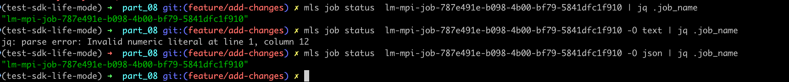
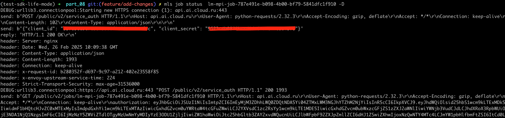
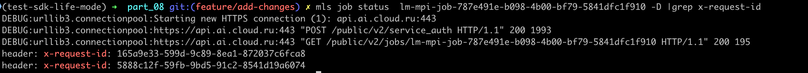
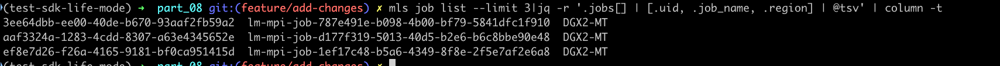
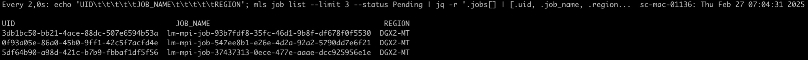

### Вопросы по настройке


**Где хранится профиль:**

1. в каталоге ~/.mls


**Как посмотреть список профилей:**

1. в каталоге ~/.mls (subl, vim, cat)
2. ```bash
   cat ~/.mls/credentials | grep -o '\[[^]]*\]'```
   
**Не устанавливается корректная версия:**

> Пакеты из pypi https://pypi.org/simple имеют зарегистрированный пакет mls
   Задавайте версию пакета буквально == 
```bash 
    pip install --index-url https://gitverse.ru/api/packages/cloudru/pypi/simple/ \
    --extra-index-url https://pypi.org/simple --trusted-host gitverse.ru mls==0.4.1
```


**Хочу иметь предзаполненный config.yaml для задач:**

Для просмотра справочных значений существуют методы 
> mls job types
>
> mls job yaml $TYPE
> 
> mls job clusters

Для того что бы сгенерировать манифест достаточно направить вывод `mls job yaml $TYPE > $TYPE.yaml`
Этот метод всегда обходит класс и отдает его наполнение согласно иерархии - т/е можно проверить всегда yaml.

Ниже пример для генерации примеров. 
```bash 
   #!/bin/bash

    # Получаем список типов из команды
    TYPES=$(mls job types)

    # Создание каталога samples, если он не существует
    mkdir -p samples

    # Проходимся по каждому из типов заданий и генерируем соответствующий файл YAML
    for TYPE in $TYPES; do
        YAML_FILE="./samples/template.$TYPE.yaml"
    
        echo "Сгенерированный набор примеров $YAML_FILE from $TYPE..."
    
        {
            echo "# 🤝 Пример запуска $TYPE... задач через ☁️👔🔒 mls job submit --config ./$YAML_FILE"
            echo "# 📚 health - 🚀Полностью опциональный параметр..."
            echo "# 📚 policy - 🚀Полностью опциональный параметр..."
            echo "# 📚 processes если не задан устанавливается в соответствии с gpu"
            echo "# 📚 Описание https://api.ai.cloud.ru/public/v2/redoc"
            echo "# 📚 Образ: https://cloud.ru/docs/aicloud/mlspace/concepts/environments__basic-images-list__jobs.html"
            echo "# 📚 max_retry параметр применимый только к аллокациям"
        } > $YAML_FILE
    
        # Генерация содержимого yaml через mls job yaml
        mls job yaml $TYPE >> $YAML_FILE
    done
    echo "Все примеры сгенерированы в каталоге samples."
```

**Работа с pipe:**
   Пример ```mls job status  lm-mpi-job-787e491e-b098-4b00-bf79-5841dfc1f910 | jq .job_name```
    
   Пояснения jq работает json ответом. Для работы pipe определите формат в котором будет работать cli глобально. 

**Сокрытие credentials :**
   * TODO

**Отладка приложения:**
   Пример ```mls job status  lm-mpi-job-787e491e-b098-4b00-bf79-5841dfc1f910 -D```
   
   Позволяет получить x-request-id или иную информацию о ходе подключения и выполнении запроса
   


**Отображение списка:**
   Пример ```mls job list --limit 3|jq -r '.jobs[] | [.uid, .job_name, .region] | @tsv' | column -t```
   

   Пример с watch. (Нужно добавить ~/.zshrc или ~/.bashrc).
   ```bash
      function wp() {
         watch -n 2 "echo 'UID\t\t\t\t\tJOB_NAME\t\t\t\t\tREGION'; mls job list --limit 3 --status Pending | jq -r '.jobs[] | [.uid, .job_name, .region] | @tsv' | column -t"
      }
   ```
   

**Профиль по умолчанию:**
   Задайте профиль в сессии терминала. Или определите в ~/.zshrc или ~/.bashrc
   > export MLS_PROFILE_DEFAULT=

**Запуск задачи с просмотром логов одной строкой:**
   > mls job logs $(mls job submit --config binary.yaml | jq -r '.job_name') -w > sample.log | tee sample.log
