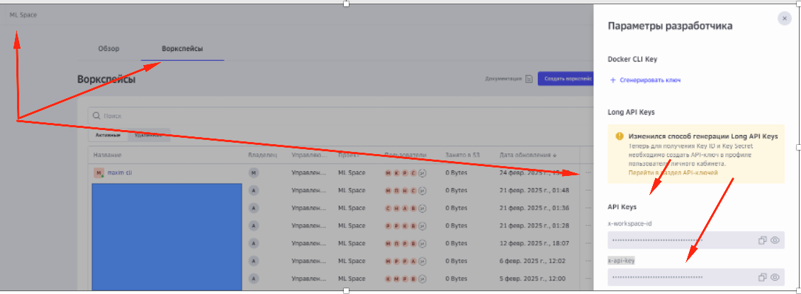
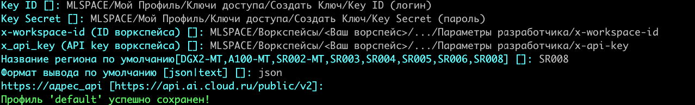
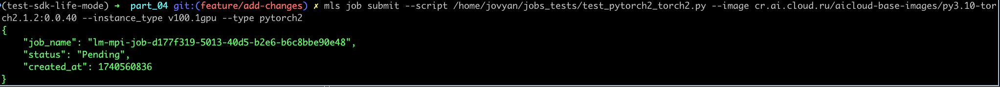

### Руководство по настройке


**Шаги:**

1. **Установка:**
   > для python3.10.* и выше
   ```bash
     pip install --index-url https://gitverse.ru/api/packages/cloudru/pypi/simple/ --extra-index-url https://pypi.org/simple --trusted-host gitverse.ru mls==0.5
   ```

2.  **Настройка:**
   
   
   
   
   
   

3. **Запуск задачи:**
   ```bash
      mls job submit --script /home/jovyan/jobs_tests/test_pytorch2_torch2.py --image cr.ai.cloud.ru/aicloud-base-images/py3.10-torch2.1.2:0.0.40 --instance_type v100.1gpu --type pytorch2
   ```
   
   
