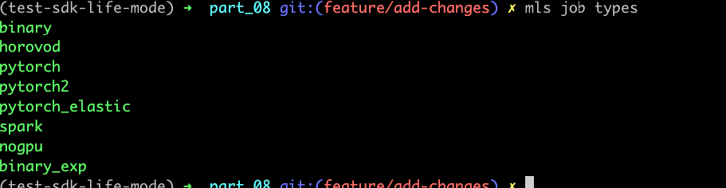
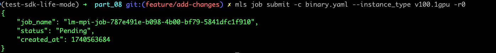
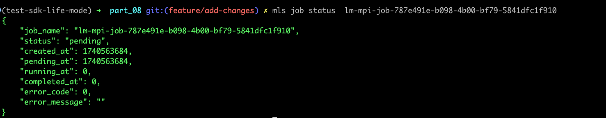

### Руководство по настройке


**Шаги:**

1. **Настройка:**
  
   Выбери тип задачи ```mls job types``` - выбирай binary если не знаешь
     
   
   Создай файл ```mls job yaml binary > binary.yaml``` 

2.  **Запуск:**

   Запусти ```mls job submit -c binary.yaml``` 
     
   Определи параметры в файле 
   
    Либо переопредели их на лету 
     

3. **Логи и Статусы:**
   Запусти ```mls job logs lm-mpi-job-787e491e-b098-4b00-bf79-5841dfc1f910``` просмотр логов
    
    
    Запусти ```mls job status  lm-mpi-job-787e491e-b098-4b00-bf79-5841dfc1f910``` просмотр статуса
    


   
   
