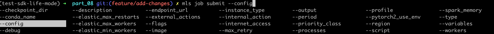

### Руководство по настройке


**Шаги:**

1. **Настройка:**
   * Данное руководство полезно для пользователей zsh 

   * 
      ```zsh
      _mls_completion() {
          autocomplete "${COMP_WORDS[@]}"
      }
      complete -F _mls_completion mls
      ```   
   * Инструкция выше добавляется в профиль (например: ~/.oh-my-zsh/oh-my-zsh.sh)
   * Перезапустите терминал zsh
   
